# Web Interface

A web interface is built into all Transmission flavors, enabling them to be controlled remotely.

## Enabling the web interface

### 1. For Windows

Open Transmission Qt. Go to Edit menu

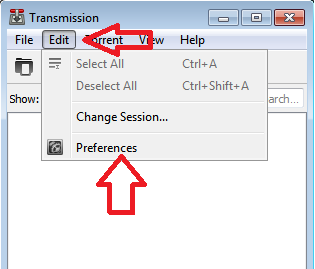

Click "Preferences". Then go to tab "Remote"

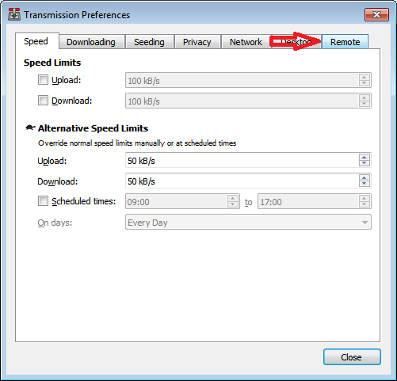

Click on "Allow remote access" checkbox. If password protection is required, click on "Use authentication" checkbox, set username and password. If "Only allow these IP addresses" is checked, Transmission will only allow the specified list of addresses to access the web interface.

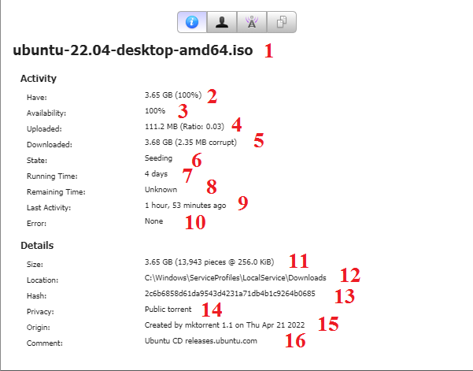

Click "Close" button. Done!

### 2. For Linux

Open Transmission. Go to Edit menu and click "Preferences".

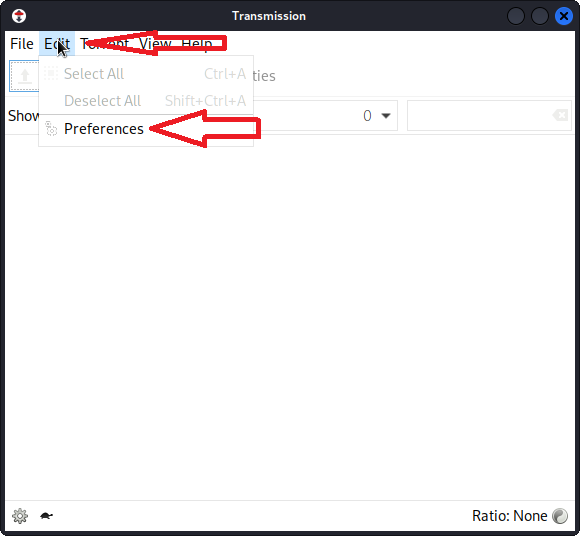

Then go to tab "Remote".

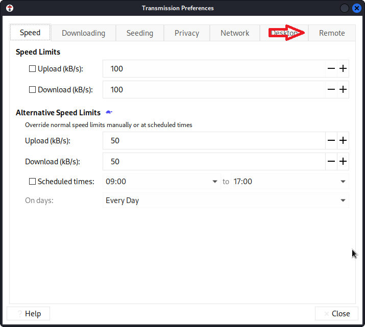

Click on "Allow remote access" checkbox. If password protection is required, click on "Use authentication" checkbox, set username and password. If "Only allow these IP addresses" is checked, Transmission will only allow the specified list of addresses to access the web interface.

Click "Close" button. Done!

### 3. For macOS

Open Transmission. Go to Transmission in the menu bar and click "Settings".

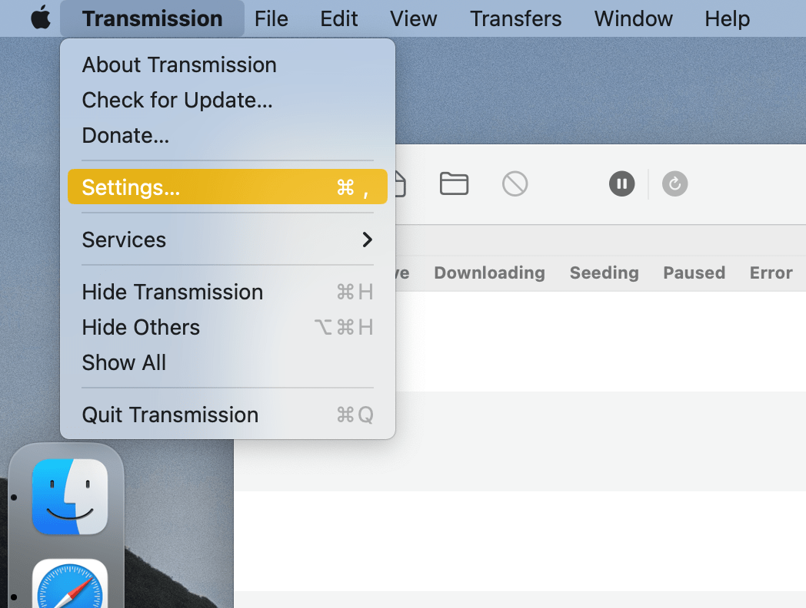

Click on "Remote" tab.

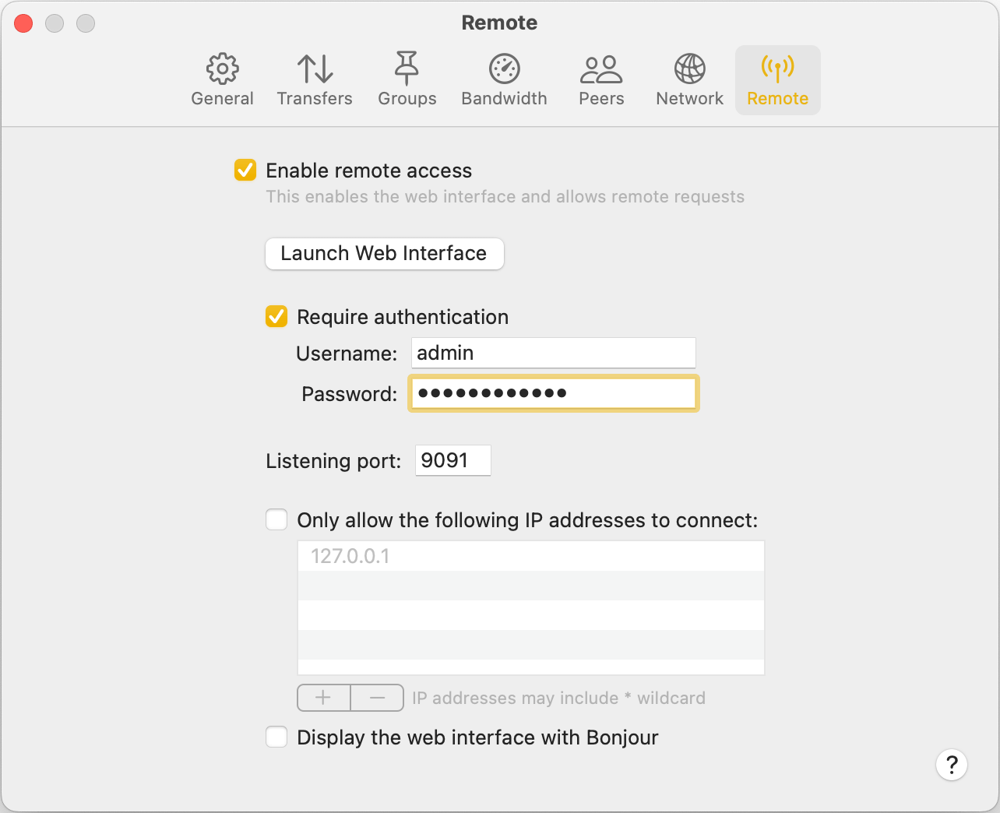

## Accessing the web interface

Once enabled, open a web browser and direct it to http://ip_address_of_machine_running_transmission:9091/
If the web browser and the Transmission daemon are on the machine you can use http://127.0.0.1:9091/
9091 is the default remote control port specified in [Transmission configuration](Editing-Configuration-Files.md) or in preferences of [Windows](https://github.com/transmission/transmission/blob/main/docs/Web-Interface.md#1-for-windows), [Linux](https://github.com/transmission/transmission/blob/main/docs/Web-Interface.md#2-for-linux) or [macOS](https://github.com/transmission/transmission/blob/main/docs/Web-Interface.md#2-for-macos) client.

## Web Interface Overview

### 1. Main Screen

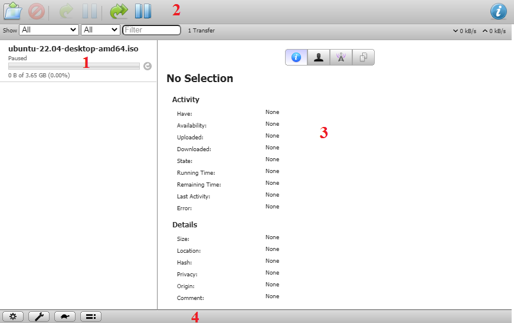

| Number On Picture | Description                 |
| ----------------- | --------------------------- |
| 1                 | Torrent name                |
| 2                 | Torrent management panel    |
| 3                 | Info about selected torrent |
| 4                 | Transmission control panel  |

### 2. Torrent management panel

| Number On Picture | Description                       |
| ----------------- | --------------------------------- |
| 1                 | Open Torrent                      |
| 2                 | Remove selected torrents          |
| 3                 | Start selected torrents           |
| 4                 | Pause selected torrents           |
| 5                 | Start all torrents                |
| 6                 | Pause all torrents                |
| 7                 | View info about selected torrents |

#### 2.1 Adding torrent

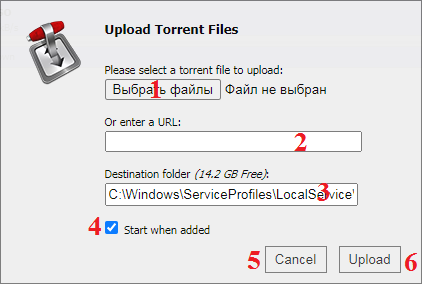

| Number On Picture | Description                                      |
| ----------------- | ------------------------------------------------ |
| 1                 | Button to select a torrent file to upload        |
| 2                 | Or enter an URL to torrent                       |
| 3                 | Enter the path where the file will be downloaded |
| 4                 | Autostart torrent download after adding          |
| 5                 | Cancel adding                                    |
| 6                 | Add selected torrent to Transmission             |

### 3. Display filters panel

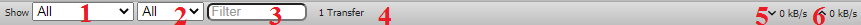

| Number On Picture | Description                                           |
| ----------------- | ----------------------------------------------------- |
| 1                 | Filter torrents by status                             |
| 2                 | Filter torrents by source                             |
| 3                 | Filter torrents by keyword                            |
| 4                 | The number of torrents found according to the filters |
| 5                 | Downloading speed                                     |
| 6                 | Uploading speed                                       |

### 4. List of added torrents

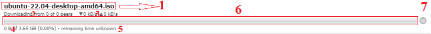

| Number On Picture | Description                                                                     |
| ----------------- | ------------------------------------------------------------------------------- |
| 1                 | Name of torrent file                                                            |
| 2                 | In current case: the torrent is downloading from 0 peers of 0 possible          |
| 3                 | Download and upload speeds of current torrent                                   |
| 4                 | In current case: the torrent is downloaded on 0 bytes of 3.65GB. This is 0.00 % |
| 5                 | The remaining time until the torrent is fully downloaded                        |
| 6                 | Progress bar showing the current progress in downloading the torrent            |
| 7                 | Pause selected torrent                                                          |

### 5. Torrent inspector

| Number On Picture | Description                                                                                                                                        |
| ----------------- | -------------------------------------------------------------------------------------------------------------------------------------------------- |
| 1                 | Name of torrent                                                                                                                                    |
| 2                 | In current case: Transmission has 3.65 GB of file data from the total volume of downloaded files, which is 100%                                    |
| 3                 | In current case: the file is available (written to disk) at 100%                                                                                   |
| 4                 | In current case: other peers have downloaded 111.2MB from you                                                                                      |
| 5                 | In current case: in total, Transmission downloaded 3.68 GB (in this case 2.35MB were corrupted, so Transmission had to re-download another 2.35MB) |
| 6                 | The current state of the torrent                                                                                                                   |
| 7                 | In current case: 4 days have passed since the torrent download was started                                                                         |
| 8                 | The remaining time until the torrent is fully downloaded                                                                                           |
| 9                 | In current case: The last torrent activity (download or upload) was 1 hour 53 minutes ago                                                          |
| 10                | If an error occurs, its details will be displayed in this field                                                                                    |
| 11                | In current case: The total size of the torrent is 3.65 GB, which is 13,943 pieces of 256KB                                                         |
| 12                | The path to the folder where the torrent is being downloaded                                                                                       |
| 13                | Torrent hash                                                                                                                                       |
| 14                | Private or public torrent                                                                                                                          |
| 15                | A field indicating which program created the torrent and at what time                                                                              |
| 16                | Comment on the torrent, usually a link to the site from where it was downloaded                                                                    |

#### 5.1 Torrent inspector peers tab

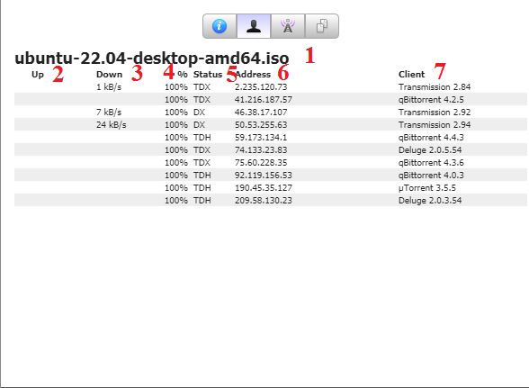

| Number On Picture | Description                                                     |
| ----------------- | --------------------------------------------------------------- |
| 1                 | Name of torrent                                                 |
| 2                 | Upload speed column                                             |
| 3                 | Download speed column                                           |
| 4                 | A column showing how many percent of the file data the peer has |
| 5                 | Peer status column(see [Peer status text](Peer-Status-Text.md)) |
| 6                 | Сolumn showing the IP address of the peer                       |
| 7                 | Column showing the Bittorrent client of the feast               |

#### 5.1 Torrent inspector trackers tab

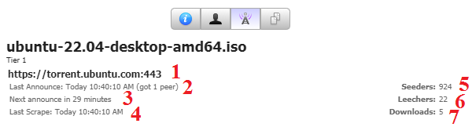

| Number On Picture | Description                                                                       |
| ----------------- | --------------------------------------------------------------------------------- |
| 1                 | URL of tracker                                                                    |
| 2                 | Date and time of the last Transmission announcement about yourself on the tracker |
| 3                 | Time until the next announcement about yourself                                   |
| 4                 | The time of the last receive of the list of tracker members                       |
| 5                 | The number of seeders - those who distribute the file                             |
| 6                 | Number of leechers - those who want to download file                              |
| 7                 | Number of current downloads                                                       |

#### 5.1 Torrent inspector files tab

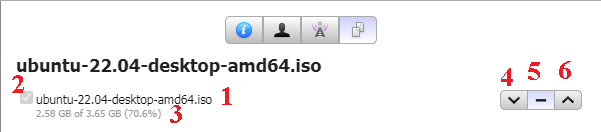

| Number On Picture | Description                                                                                           |
| ----------------- | ----------------------------------------------------------------------------------------------------- |
| 1                 | The name of the file marked for download                                                              |
| 2                 | This checkbox controls the file upload. If you uncheck it, the file will not load                     |
| 3                 | In current case: the torrent is downloaded on 2.58GB of 3.65GB. This is 70.6%                         |
| 4                 | With this button you can change downloading priority of this file to low                              |
| 5                 | With this button you can change downloading priority of this file to medium. This priority is default |
| 6                 | With this button you can change downloading priority of this file to high                             |
